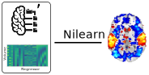
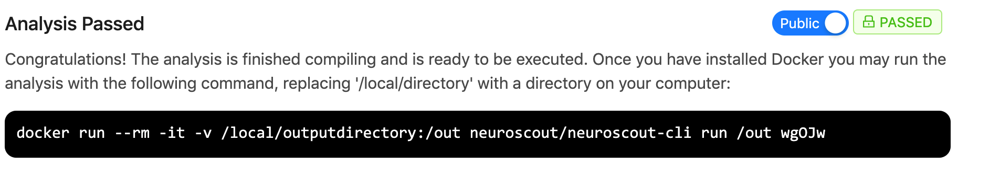
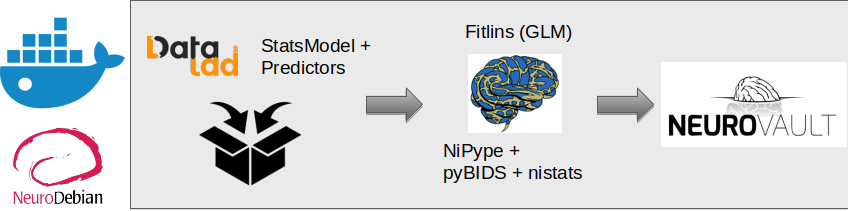
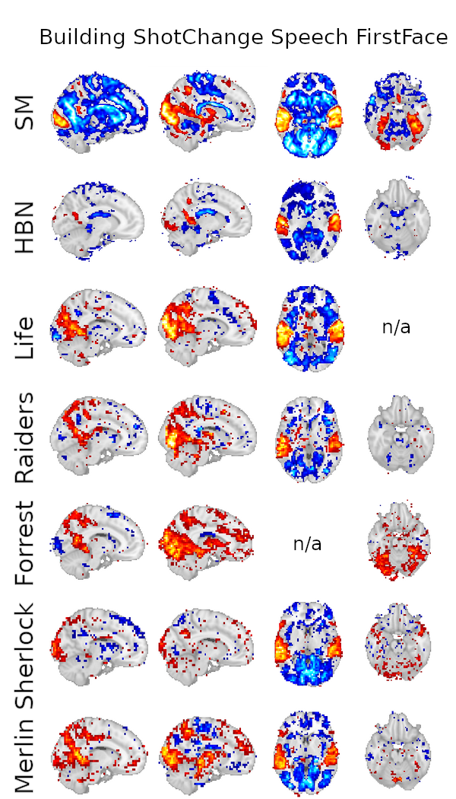

class: center middle

# The BIDS Ecosystem
### Christopher J. Markiewicz
#### Center for Reproducible Neuroscience
#### Stanford University

###### [effigies.github.io/bids-ecosystem](https://effigies.github.io/bids-ecosystem)

---
name: footer
layout: true

<div class="slide-slug">BIDS Ecosystem - Neuro Data Science School - May 2020</div>

---

# Outline

1. BIDS Review

2. BIDS Validator

3. PyBIDS

4. BIDS-Apps

5. Derivatives

6. Case Study: FitLins/Neuroscout

---
layout: true
template: footer
name: BIDS

# BIDS: Brain Imaging Data Structure

---
layout: true
template: BIDS

.pull-left[]

---

.pull-right[
* BIDS is a directory structure, based on common practices

* Builds on existing standards (NIfTI, JSON, TSV)

* Intended for human *and* machine legibility

* The [BIDS Validator](https://bids-standard.github.io/bids-validator)
  makes compliance easy to verify

* The [specification](https://bids-specification.readthedocs.io/en/stable/)
  is a searchable HTML document
]

---

.pull-right[

* Basic metadata in the file names

  * Subject, session, imaging modality, etc.
  * Generally just enough to assign unique names

]

---
count: false

.pull-right[
* Basic metadata in the file names
  * Subject, session, imaging modality, etc.
  * Generally just enough to assign unique names

* NIfTI headers and JSON sidecars contain detailed,
  image-related metadata

]

---
count: false

.pull-right[
* Basic metadata in the file names
  * Subject, session, imaging modality, etc.
  * Generally just enough to assign unique names

* NIfTI headers and JSON sidecars contain detailed,
  image-related metadata

* [`dataset_description.json`](https://bids-specification.readthedocs.io/en/stable/03-modality-agnostic-files.html#dataset_descriptionjson),
  [`participants.tsv`](https://bids-specification.readthedocs.io/en/stable/03-modality-agnostic-files.html#participants-file),
  [`sessions.tsv`](https://bids-specification.readthedocs.io/en/stable/05-longitudinal-and-multi-site-studies.html#sessions-file),
  and [`scans.tsv`](https://bids-specification.readthedocs.io/en/stable/03-modality-agnostic-files.html#scans-file)
  record study-level metadata that may not be associated
  with specific images
]

---
layout: true
template: footer

---

# Bidsification

Constructing a BIDS dataset can be tedious and error-prone, so there are several
[converters](https://bids.neuroimaging.io/benefits.html#converters).

<figure style="width: 60%">

</figure>

DICOM images store their relevant metadata internally, but naming conventions tend
to be scanner/institution-specific.

The [Heuristic DICOM Converter](https://heudiconv.readthedocs.io/) (HeuDiConv) and
[bidsify](https://github.com/NILAB-UvA/bidsify) allow you to specify the mapping and
apply in bulk. Both build off of [dcm2niix](https://github.com/rordenlab/dcm2niix/).

---

# Bidsification: ReproIn

The [ReproIn](https://github.com/ReproNim/reproin) project aims to
standardize scanner conventions, to eliminate the need to rewrite these mappings.

<figure style="width: 60%">

<figcaption>From <a href="https://github.com/ReproNim/reproin/blob/master/README.md#overall-workflow">ReproIn</a>;
doi:</figcaption>
</figure>

---

.install-cmd[
```Bash
npm install -g bids-validator
```
]

# BIDS Validator

The machine-readable structure makes validation possible:

```Bash
$ bids-validator /data/bids/openneuro/ds000228
bids-validator@1.5.3

        1: [WARN] Task scans should have a corresponding events.tsv file. If this is a resting state scan you can ignore this warning or rename the task to include the word "rest". (code: 25 - EVENTS_TSV_MISSING)
                ./sub-pixar001/func/sub-pixar001_task-pixar_bold.nii.gz
                ./sub-pixar002/func/sub-pixar002_task-pixar_bold.nii.gz
                ./sub-pixar003/func/sub-pixar003_task-pixar_bold.nii.gz
                ./sub-pixar004/func/sub-pixar004_task-pixar_bold.nii.gz
                ./sub-pixar005/func/sub-pixar005_task-pixar_bold.nii.gz
                ./sub-pixar006/func/sub-pixar006_task-pixar_bold.nii.gz
                ./sub-pixar007/func/sub-pixar007_task-pixar_bold.nii.gz
                ./sub-pixar008/func/sub-pixar008_task-pixar_bold.nii.gz
                ./sub-pixar009/func/sub-pixar009_task-pixar_bold.nii.gz
                ./sub-pixar010/func/sub-pixar010_task-pixar_bold.nii.gz
                ... and 145 more files having this issue (Use --verbose to see them all).
...
```

.center[
## https://bids-standard.github.io/bids-validator/
]

---
layout: true
template: footer

.install-cmd[
```Bash
pip install pybids
```
]

---

# PyBIDS

A common specification of neuroimaging datasets affords queries for and
adaptation to the available data.

[PyBIDS](https://github.com/bids-standard/pybids/) is a Python library for
querying and manipulating BIDS datasets.


```Python
>>> from bids import BIDSLayout
>>> layout = BIDSLayout('/data/bids/openneuro/ds000228')
>>> bold = layout.get(subject='pixar002', suffix='bold', extension='nii.gz')
>>> bold
[<BIDSImageFile filename='/data/bids/openneuro/ds000228/sub-pixar002/func/sub-pixar002_task-pixar_bold.nii.gz'>]
>>> md = bold[0].get_metadata()
>>> md['RepetitionTime']
2
>>> bold[0].get_entities()
{'datatype': 'func',
 'extension': 'nii.gz',
 'subject': 'pixar002',
 'suffix': 'bold',
 'task': 'pixar'}
```

---

# PyBIDS - File queries

`get` queries return all matching files:

```Python
>>> layout.get(subject='pixar002')
[<BIDSJSONFile filename='/data/bids/openneuro/ds000228/sub-pixar002/anat/sub-pixar002_T1w.json'>,
 <BIDSImageFile filename='/data/bids/openneuro/ds000228/sub-pixar002/anat/sub-pixar002_T1w.nii.gz'>,
 <BIDSJSONFile filename='/data/bids/openneuro/ds000228/sub-pixar002/func/sub-pixar002_task-pixar_bold.json'>,
 <BIDSImageFile filename='/data/bids/openneuro/ds000228/sub-pixar002/func/sub-pixar002_task-pixar_bold.nii.gz'>]
```

--

Operating over a set of files is straightforward:

```Python
# Correct image headers from BIDS metadata
for bold_series in layout.get(suffix='bold', extension='nii.gz'):
    img = bold_series.get_image()  # Returns nibabel image object
    zooms = img.header.get_zooms()
    zooms[3] = bold_series.get_metadata()['RepetitionTime']
    img.header.set_zooms(zooms)
    img.to_filename(bold_series)
```

---

# PyBIDS - Entity queries

Each file has a set of associated entities, such as `subject`, `task`, `suffix` or `extension`.
You can query the layout for what entities exist for *any* file:

```Python
>>> layout.get_subjects()
['pixar001',
 'pixar002',
 ...
 'pixar155']
>>> layout.get_tasks()
['pixar']
>>> layout.get_suffixes(subject=bids.layout.Query.ANY)
['bold', 'T1w']
```

--

A full list of possible entities can be found:

```Python
>>> list(layout.get_entities(metadata=False))
['subject',
 'session',
 'task',
 'acquisition',
 'ceagent',
  ...
]
```

---

# PyBIDS - Metadata queries

BIDS has [The Inheritance Principle](https://bids-specification.readthedocs.io/en/v1.3.0/02-common-principles.html#the-inheritance-principle):

> Any metadata file [...] may be defined at any directory level [...]. The values from the top level are inherited by all lower levels unless they are overridden by a file at the lower level.

For example, in ds000228:

.left-column-mid[
* `task-pixar_bold.json`

```JSON
{
    "EchoTime": 0.03,
    "RepetitionTime": 2,
    "MagneticFieldStrength": 3,
    "dcmmeta_slice_dim": 2,
    ...
}
```
]
.right-column-mid[
* `sub-pixar001/func/sub-pixar001_task-pixar_bold.json`

```JSON
{
    "FlipAngle": 90,
    ...
}
```
]

---

# PyBIDS - Metadata queries

PyBIDS applies the inheritance principle, so metadata spread throughout the
dataset is associated with each relevant file:

```Python
>>> bold_file = layout.get(subject='pixar001', suffix='bold',
...                        extension=['nii', 'nii.gz'])[0]
>>> md = bold_file.get_metadata()
>>> md.keys()
dict_keys(['CogAtlasID', 'EchoTime', 'EffectiveEchoSpacing', 'FlipAngle',
           'MagneticFieldStrength', 'Manufacturer', ...])
>>> md['EchoTime']
0.03
>>> md['FlipAngle']
90
```

Many metadata terms are optional in BIDS, so queries that may work smoothly
in one dataset, or on one file, may fail on others:

```Python
>>> md['SliceEncodingDirection']
KeyError: "Metadata term 'SliceEncodingDirection' unavailable for file /data/bids/openneuro/ds000228/sub-pixar001/func/sub-pixar001_task-pixar_bold.nii.gz."
```

---

# PyBIDS - Metadata queries

Like filename entities, metadata entities get convenience methods:

```Python
>>> layout.get_FlipAngles()
[7, 84, 88, 89, 90]
```

--

These can be constrained to answer (maybe) interesting questions:

```Python
>>> layout.get_suffix(FlipAngle=7)
['T1w']
>>> layout.get_suffix(FlipAngle=88)
['bold']
>>> layout.get_FlipAngle(suffix='bold')
[84, 88, 89, 90]
```

--

How common is each?

```Python
>>> {fa: len(layout.get(FlipAngle=fa))
     for fa in layout.get_FlipAngle(suffix='bold')}
{84: 1, 88: 1, 89: 1, 90: 152}
>>> layout.get_subjects(FlipAngle=88)
['pixar028']
```

---
layout: true
template: footer

.install-cmd[
```Bash
datalad clone ///openneuro/ds000224
```
]

---

# PyBIDS - Tabular data

The Midnight Scan Club dataset contains a lot of tabular data, so we will use that:

```Python
>>> layout = BIDSLayout('/data/bids/openneuro/ds000224')
```

--

TSV files can be accessed just like NIfTI files, and their contents loaded as
[Pandas](https://pandas.pydata.org/) dataframes:

```Python
>>> participants = layout.get(suffix='participants', extension='tsv')[0]
>>> participants
<BIDSDataFile filename='/data/bids/openneuro/ds000224/participants.tsv'>
>>> participants.get_df()
  participant_id gender  age education_degree  education_years
0      sub-MSC01      M   34        Doctorate             22.0
1      sub-MSC02      M   34        Doctorate             28.0
...
9      sub-MSC10      M   31     Professional             19.0
```

---

# PyBIDS - Tabular data

PyBIDS can also aggregate file metadata along with the `get_collections()` method:

```Python
>>> collections = layout.get_collections(level='dataset')
>>> collections
[<bids.variables.collections.BIDSVariableCollection at 0x7f5e1b6467f0>]
```

This object is useful for manipulating the data programmatically, such as when
running [BIDS Statistical Models](https://bids.neuroimaging.io/bep002).

--

For a more familiar interface, dataframes are retrievable:

```Python
>>> collections[0].to_df()
         suffix subject age education_degree education_years gender
0  participants   MSC01  34        Doctorate              22      M
1  participants   MSC02  34        Doctorate              28      M
...
9  participants   MSC10  31     Professional              19      M
```

Note the suffix of the containing file is now a column, and the subject
column has replaced `participant_id` (and the `sub-` has been dropped).

---

# PyBIDS - Tabular data

The `'subject'` level shows the subject's `sessions.tsv`:

```Python
>>> layout.get_collections(level='subject', subject='MSC01')[0].to_df()
     session    suffix subject             acq_time
0     func01  sessions   MSC01  1894-08-25T01:07:51
1     func02  sessions   MSC01  1894-08-26T00:09:21
...
11  struct02  sessions   MSC01  1894-06-29T00:12:09
```

--

The `'session'` level shows the scans in the session:

```Python
>>> layout = BIDSLayout('/data/bids/openneuro/ds000224')
>>> layout.get_collections(level='session', subject='MSC01', session='func01')[0].to_df()
           task suffix  ...      TaskName             acq_time
0  glasslexical   bold  ...  glasslexical  1894-08-25T02:44:47
1  glasslexical   bold  ...  glasslexical  1894-08-25T02:53:17
2         motor   bold  ...         motor  1894-08-25T02:37:34
3         motor   bold  ...         motor  1894-08-25T03:00:54

[4 rows x 30 columns]
```

Note that metadata from `*_bold.json` (`TaskName` + ~20 columns) is also here.

---

# PyBIDS - Tabular data

The `'run'` level collects data from `events.tsv`, `*_physio.tsv.gz`, `*_stim.tsv.gz` or
`*_regressors.tsv`.

```Python
>>> layout.get_collections(level='run', subject='MSC01', session='func01',
                           task='motor', run=1)[0].to_df()
    task suffix subject  run  duration  onset session datatype trial_type
0  motor   bold   MSC01    1      15.4    8.8  func01     func      RHand
1  motor   bold   MSC01    1      15.4   24.2  func01     func      RFoot
2  motor   bold   MSC01    1      15.4   55.0  func01     func      LFoot
3  motor   bold   MSC01    1      15.4   70.4  func01     func     Tongue
...
```

---
layout: true
template: footer

---

# PyBIDS - Generating data

PyBIDS has the capability to generate filenames, if you need to add metadata to a
dataset.

```Python
>>> import json
>>> entities = {"task": "rest", "suffix": "bold", "extension": "json"}
>>> layout.build_path(entities)
/data/bids/openneuro/ds000228/task-rest_bold.json
>>> layout.write_contents_to_file(
...     entities, contents=json.dumps({"Instructions": "Just relax."}))
```

Adding entities produces more complex filenames.

--

Summaries of the data can also be generated.

```Python
>>> from bids.report import BIDSReport
>>> reports = BIDSReport(layout).generate()
>>> print(reports.most_common()[0][0])
For session None:
	MR data were acquired using a 3-Tesla Siemens TrioTim MRI scanner.
	Zero runs of pixar single-echo fMRI data were collected (32 slices in interleaved descending order; repetition time, TR=2000ms; echo time, TE=30ms; flip angle, FA=90<deg>; field of view, FOV=192x192mm; matrix size=64x64; voxel size=3x3x3.3mm). Each run was 5:36 minutes in length, during which 168 functional volumes were acquired.

Dicoms were converted to NIfTI-1 format. This section was (in part) generated automatically using pybids (0.10.2).
```

---

# PyBIDS - Final thoughts

Many grad students have written a large subset of the preceding for their own labs.

* File structure, mirroring inputs/outputs of the preferred tool suite (FreeSurfer, AFNI, etc.)

--
* A metadata folder, file or database, containing study parameters and individual subject/session details

--
* A library of functions for fetching files, metadata, computing data, and saving results

--

Each lab's pipelines are inevitably idiosyncratic, and to reproduce with someone else's data,
the data must be reformatted to fit code expectations, or the code must be modified to handle
the new structure.

--

By standardizing on a data structure, code written to that structure gains stability and
broad applicability.

--

<hr>

[BIDS-MATLAB](https://github.com/bids-standard/bids-matlab) is a similar project for MATLAB / Octave


---
class: center middle

# Break (?)

---
layout: true
template: footer
name: Apps

# BIDS Applications

---

A common specification of neuroimaging datasets affords queries for and
adaptation to the available data.

--

Queryable (meta)data allows a very simple protocol for a
[BIDS App](https://bids-apps.neuroimaging.io/apps/):

```Bash
bids-app /bids-directory /output-directory participant [OPTIONS]
```

.footnote[
\* Note that `participant` is an analysis level. Apps may also operate
at the `run`, `session` or `group` levels.
]

--

## Examples

**MRIQC**

```Bash
mriqc /data/bids/openneuro/ds000228 /data/processed/ds000228-mriqc group
```

--

**fMRIPrep**

```Bash
fmriprep /data/bids/openneuro/ds000228 /data/processed/ds000228-fmriprep \
    participant --participant-label pixar001
```

---

.pull-left[
### Many application types are possible
]
.pull-right[
[](https://bids-apps.neuroimaging.io/apps/)
]

---
count: false

.pull-left[
### Many application types are possible

* Quality control

]
.pull-right[
[](https://bids-apps.neuroimaging.io/apps/)
]

---
count: false

.pull-left[
### Many application types are possible

* Quality control

* Anatomical pipelines

]
.pull-right[
[](https://bids-apps.neuroimaging.io/apps/)
]

---
count: false

.pull-left[
### Many application types are possible

* Quality control

* Anatomical pipelines

* Functional pipelines

]
.pull-right[
[](https://bids-apps.neuroimaging.io/apps/)
]

---
count: false

.pull-left[
### Many application types are possible

* Quality control

* Anatomical pipelines

* Functional pipelines

* Diffusion pipelines

]
.pull-right[
[](https://bids-apps.neuroimaging.io/apps/)
]

---
count: false

.pull-left[
### Many application types are possible

* Quality control

* Anatomical pipelines

* Functional pipelines

* Diffusion pipelines

### Lowered friction encourages adoption

* Researchers gain easy access to tools by formatting data
  in BIDS

* Accepting BIDS datasets makes your tools easy to try

]
.pull-right[
[](https://bids-apps.neuroimaging.io/apps/)
]

---
layout: true
template: footer

# Example: Summarize scan parameters

A [short program](assets/example-bids-app.py) to summarize variations in scan parameters across subjects.

---
---
count: false

```Python
import sys
from pathlib import Path
from bids import BIDSLayout
from bids.reports import BIDSReport
```

Import some BIDS tools and Python libraries.

---
count: false

```Python
import sys
from pathlib import Path
from bids import BIDSLayout
from bids.reports import BIDSReport

cmd, bids_root, out_root, analysis_level, *opts = sys.argv
layout = BIDSLayout(bids_root)
```

Collect the command-line arguments to implement the BIDS Apps protocol.

There are libraries to help add options, but this is the heart of it.

---
count: false

```Python
import sys
from pathlib import Path
from bids import BIDSLayout
from bids.reports import BIDSReport

cmd, bids_root, out_root, analysis_level, *opts = sys.argv
layout = BIDSLayout(bids_root)

reports = {}
for subject in layout.get_subjects():
    rep = list(BIDSReport(layout).generate(subject=subject))[0]
    reports.setdefault(rep, []).append(subject)
```

Generate a report per subject. Add the subject to a list associated with
report text.

---
count: false

```Python
import sys
from pathlib import Path
from bids import BIDSLayout
from bids.reports import BIDSReport

cmd, bids_root, out_root, analysis_level, *opts = sys.argv
layout = BIDSLayout(bids_root)

reports = {}
for subject in layout.get_subjects():
    rep = list(BIDSReport(layout).generate(subject=subject))[0]
    reports.setdefault(rep, []).append(subject)

with open(Path(out_root) / "report.txt", "w") as out_file:
    out_file.write(f"Scan parameter sets detected: {len(reports)}\n\n")
    for rep, subs in reports.items():
```

Write the number of scans parameter sets to a report file, then
for each set...

---
count: false

```Python
import sys
from pathlib import Path
from bids import BIDSLayout
from bids.reports import BIDSReport

cmd, bids_root, out_root, analysis_level, *opts = sys.argv
layout = BIDSLayout(bids_root)

reports = {}
for subject in layout.get_subjects():
    rep = list(BIDSReport(layout).generate(subject=subject))[0]
    reports.setdefault(rep, []).append(subject)

with open(Path(out_root) / "report.txt", "w") as out_file:
    out_file.write(f"Scan parameter sets detected: {len(reports)}\n\n")
    for rep, subs in reports.items():
        rep = "\n".join(rep.splitlines()[:-2])
        out_file.write(f"-----\nParameters for subjects: {', '.join(subs)}\n\n")
        out_file.write(rep.replace("<deg>", "°") + "\n\n")
```

... report which subjects had the same parameters, and what they were.

---

To run the app:

```Bash
python ./example-bids-app.py /data/ds000228 /data/out/ds000228-example group
```

Output ([download](assets/report.txt)):

```text
Scan parameter sets detected: 9

-----
Parameter set detected for subjects: pixar001, pixar002, pixar003, pixar008, pixar009, pixar010, pixar011, pixar013, pixar014, pixar015, pixar016, pixar017, pixar018, pixar020, pixar021, pixar022, pixar023, pixar024, pixar025, pixar026, pixar027, pixar029, pixar030, pixar031

For session None:
	MR data were acquired using a 3-Tesla Siemens TrioTim MRI scanner.
	T1-weighted structural MRI data were collected (192 slices; repetition time, TR=2530ms; echo time, TE=1.64ms; flip angle, FA=7°; field of view, FOV=176x192mm; matrix size=176x192; voxel size=1x1x1mm).
	Zero runs of pixar single-echo fMRI data were collected (32 slices in interleaved descending order; repetition time, TR=2000ms; echo time, TE=30ms; flip angle, FA=90°; field of view, FOV=192x192mm; matrix size=64x64; voxel size=3x3x3.3mm). Each run was 5:36 minutes in length, during which 168 functional volumes were acquired.
...
```

--

In a more complicated application, you might modulate processing based on these differences.

---
layout: true
template: Apps

---

For development and distribution, BIDS Apps encourages a continuous-integration
(CI) approach.

<figure style="width: 70%">

<figcaption>From doi:</figcaption>
</figure>

--

The uniform interface also eases deployment to HPC or cloud environments like
[CBRAIN](http://mcin.ca/technology/cbrain/) or [AWS Batch](https://aws.amazon.com/batch/).

---

BIDS Apps use the notion of analysis levels, which provide natural opportunities for
parallelism.

<figure style="width: 100%">

<figcaption>From doi:</figcaption>
</figure>

---
layout: true
template: footer

# BIDS Apps and Reproducibility

---

Start-to-finish pipelines aid in performing *reproducible* analyses.

<figure style="width: 60%">

<figcaption>From <a href="https://the-turing-way.netlify.app/reproducibility/03/definitions.html#The-Turing-Way-definition-of-reproducibility">The
Turing Way, Ch. 2</a>; doi:</figcaption>
</figure>

--

Open analysis on open data is subject to independent reproduction.

--

Accepting BIDS datasets makes *replicating* results on independent data easier.

---

<figure style="width: 28%; margin-right: 0; margin-top: -1em;">

<figcaption>From <a href="https://the-turing-way.netlify.app/reproducibility/03/definitions.html#The-Turing-Way-definition-of-reproducibility">The
Turing Way, Ch. 2</a>; doi:</figcaption>
</figure>

Reusable code is only one part of reproducibility. Does it always produce the
same result?

Sources of variability:

* Operating system (version) &mdash; see, *e.g.*,
  [Gronenschild, et al. (2012)](https://doi.org/10.1371/journal.pone.0038234
   "The Effects of FreeSurfer Version, Workstation Type, and Macintosh Operating
   System Version on Anatomical Volume and Cortical Thickness Measurements")
* Dependency versions &mdash; see, *e.g.*,
  [Glatard, et al. (2015)](https://doi.org/10.3389/fninf.2015.00012
   "Reproducibility of neuroimaging analyses across operating systems")
* Stochastic (random) components

--

Container technnologies partially address environmental sources of variability.
The [Neurodocker](https://github.com/ReproNim/neurodocker) project aims to
make the creation of consistent environments simpler.

--

Tools for quantifying run-to-run reproducibility are in progress.

---
layout: true
template: footer
name: Derivatives

# BIDS Derivatives

---

The output of a BIDS App is a *derivative* dataset. The BIDS standard is
[being extended](https://bids-specification.readthedocs.io/en/derivatives/05-derivatives/01-introduction.html)
to describe many types of derivatives, with a focus on derivatives that
can be reused in yet more BIDS apps.


--

#### Dataset-level metadata is stored in augmented [`dataset_description.json`](https://bids-specification.readthedocs.io/en/derivatives/05-derivatives/01-introduction.html#derived-dataset-and-pipeline-description):

* `PipelineDescription` contains references to the code (including version)
  that produced the derivative dataset.
* `SourceDatasets` is a list of references to the specific version of the
  dataset analyzed

--

#### Basic metadata remains in filenames

```
fmriprep/sub-01/func/sub-01_task-rest_space-fsaverage_hemi-L.func.gii
```

--

#### Additional metadata in [sidecar JSON files](https://bids-specification.readthedocs.io/en/derivatives/05-derivatives/01-introduction.html#common-file-level-metadata-fields)

* `Sources`: input files to the process that produced the file
* `SpatialReference`: structural images/surfaces needed for interpretation

---

Derivatives generally fall into three categories:

1. Preprocessed images (or otherwise transformed data) that can be used for further
  analysis

  * Tissue segmentations
  * Normalized BOLD series
  * Fitted diffusion model parameters

--

2. Measures of statistics of interest

  * Parcellation statistics
  * Local functional connectivity density
  * Fractional anisotropy

--

3. Figures and reports for assessing the quality of data/processing

---
template: footer
class: center middle

# Break (?)

---
layout: true
template: footer
name: FitLins

.install-cmd[
```Bash
pip install fitlins
```
]

# Case Study: FitLins

---
layout: true
template: FitLins

## FitLins is a BIDS-aware GLM-estimation framework

FitLins takes as inputs:

---

* A BIDS dataset - task *events*, physiological *time series*, etc.
.center[

]

---
count: false

* A BIDS dataset - task *events*, physiological *time series*, etc.
* BIDS Derivatives - preprocessed *BOLD series*, confound *time series*, etc.
.center[

]

---
count: false

* A BIDS dataset - task *events*, physiological *time series*, etc.
* BIDS Derivatives - preprocessed *BOLD series*, confound *time series*, etc.
* A BIDS statistical model - a JSON structure for constructing design matrices and contrasts

.center[

]

---
count: false

* A BIDS dataset - task *events*, physiological *time series*, etc.
* BIDS Derivatives - preprocessed *BOLD series*, confound *time series*, etc.
* A BIDS statistical model - a JSON structure for constructing design matrices and contrasts

It then uses [Nistats](https://nistats.github.io/) (now part of
[Nilearn](https://nilearn.github.io/)) to estimate responses to conditions of interest.

.center[

]

---
count: false

* A BIDS dataset - task *events*, physiological *time series*, etc.
* BIDS Derivatives - preprocessed *BOLD series*, confound *time series*, etc.
* A BIDS statistical model - a JSON structure for constructing design matrices and contrasts

It then uses [Nistats](https://nistats.github.io/) (now part of
[Nilearn](https://nilearn.github.io/)) to estimate responses to conditions of interest.

Usage:
```Bash
$ fitlins data/ output/ dataset \
    --derivatives preprocessed_data/ \
    --model model-label_smdl.json
```

([Example report](assets/docs/_static/reports/model-ds003Model001.html))

---
layout: true
template: FitLins

---

## In one slide

Take the inputs:

```Bash
fitlins data/ output/ dataset --derivatives derivs/ --model model.json
```

--

FitLins does the following:

```Python
layout = bids.BIDSLayout("data/", derivatives=["derivs/"])
analysis = bids.analysis.Analysis(model="model.json", layout=layout)
analysis.setup()
images = layout.get(desc="preproc", suffix="bold", extension=["nii", "nii.gz"])
for steps in analysis.steps:
    # Exact details of fit depend on level
    images = [fit(img, dm)
              for img, dm in zip(images, step.get_design_matrix())]
```

--

The rest\* is all book-keeping.

.footnote[
\* For the interested, the [Nipype](https://nipype.readthedocs.io) library is used to organize
and execute the entire procedure.
]

---
layout: true
template: footer

# Case Study: ~~FitLins~~ Neuroscout

.footnote[
The Neuroscout section of the presentation borrows liberally from Alejandro de la Vega's
[2019 presentation at OHBM](https://www.pathlms.com/ohbm/courses/12238/sections/15845/video_presentations/138230).
]

---

[Neuroscout](https://neuroscout.org) is a web-based platform for fast and flexible analysis of
fMRI data.

--

## Open, naturalistic datasets

.right-column-inv[

]

* [Healthy Brain Network](https://fcon_1000.projects.nitrc.org/indi/cmi_healthy_brain_network/) (*Alexander et al., 2017*)
* [Life Documentary](https://datasets.datalad.org/?dir=/labs/haxby/life) (*Nastase et al., 2017*)
* [StudyForrest](http://studyforrest.org) (*Hanke et al., 2014*)
* [LearningTemporalStructure](https://openneuro.org/datasets/ds001545) (*Aly et al., 2018*)
* [ParanoiaStory](https://openneuro.org/datasets/ds001338) (*Finn et al., 2018*)
* [Raiders](https://github.com/HaxbyLab/raiders_data) (*Haxby et al., 2011*)
* ...

--

All datasets are available in BIDS format and accessible via [Datalad](https://www.datalad.org/),
and preprocessed with [fMRIPrep](https://fmriprep.readthedocs.io).

---

## Automatically-generated annotations

In typical fMRI studies, subjects engage in discrete events that can be modeled.

To analyze passive audiovisual tasks, the stimulus must be annotated for possible features of
interest, as well as potential confounds.

[pliers](https://github.com/tyarkoni/pliers) is a Python library to extract features:

* Visual
  * Faces: location, parts, emotion
  * Scene labeling (e.g., "building", "vehicle", "room")
  * Low-level statistics (e.g., brightness, colors, optical flow, etc.)
* Auditory
  * Speech (e.g., word identity, frequency, sentiment, part of speech)
  * Low-level statistics (e.g., loudness, frequencies, etc.)

---


---


---

## Automated data retrieval and modeling



--



---

.pull-left[
## Example results


]

--

## So what is this?

Neuroscout allows for *rapid hypothesis generation*, and testing these hypotheses
on several, large, independently collected datasets.

--

This is possible because researchers at many universities are willing
to share large amounts of (expensive) data, freely.

--

Crucially, they shared these data as **BIDS** datasets
--
, which can be processed with **BIDS Apps** like fMRIPrep
--
, producing **BIDS Derivatives**
--
, which can be analyzed with further BIDS Apps like FitLins.

---
layout: true
template: footer

---

# Conclusion

* BIDS is a standard for organizing neuroimaging data and metadata

--

* PyBIDS provides programmatic access to files and metadata in BIDS datasets

--

* BIDS Apps use a common protocol to process datasets, improving interoperability and
  facilitating reproducibility.

--

* BIDS Derivatives are processed datasets that can be queried like BIDS datasets, enabling
  higher-order applications.

--

* Apps incentivize using BIDS, datasets incentivize writing apps.

--

* A growing ecosystem makes it worthwhile to produce tools that can take advantage of open
  datasets and derivatives.

---

# Credits

* BIDS
  * The BIDS community (~120 named contributors)
  * Prime movers: Chris Gorgolewski, Russ Poldrack
* PyBIDS
  * Tal Yarkoni + 44 named contributors
* FitLins
  * Chris Markiewicz, Alejandro de la Vega, Dylan Nielson, et al.
* Neuroscout
  * Alejandro de la Vega, Tal Yarkoni, Ross Blair, et al.
* Datalad
  * Yaroslav Halchenko, Michael Hanke, et al.
* Nipype
  * Satra Ghosh, Oscar Esteban, et al.
* fMRIPrep
  * Oscar Esteban, Mathias Goncalves + ~45 named contributors

---

# Resources

.left-column-mid[
* [BIDS](https://bids.neuroimaging.io)
   * [Starter Kit](https://github.com/bids-standard/bids-starter-kit)
   * [Specification](https://bids-standard.rtfd.io)
   * [Extension proposals](https://bids.neuroimaging.io/get_involved.html#extending-the-bids-specification)
      * [BEP002](https://bids.neuroimaging.io/bep002): Stats Models
      * [BEP003](https://bids-specification.readthedocs.io/en/derivatives/05-derivatives/01-introduction.html): Derivatives
* [BIDS Validator](https://bids-standard.github.io/bids-validator)
* [BIDS Converters](https://bids.neuroimaging.io/benefits.html#converters)
   * [dcm2niix](https://github.com/rordenlab/dcm2niix/)
   * [HeuDiConv](https://heudiconv.readthedocs.io/)
   * [bidsify](https://github.com/NILAB-UvA/bidsify)
* [PyBIDS](https://github.com/bids-standard/pybids)
   * [Tutorial](https://mybinder.org/v2/gh/bids-standard/pybids/master?filepath=examples%2Fpybids_tutorial.ipynb)
* [BIDS Apps](https://bids-apps.neuroimaging.io/)
   * [Paper](https://doi.org/10.1371/journal.pcbi.1005209)
]
.right-column-mid[
* [ReproNim](https://www.repronim.org/)
   * [ReproIn](https://github.com/ReproNim/reproin)
   * [Neurodocker](https://github.com/ReproNim/neurodocker)
* [The Turing Way](https://the-turing-way.netlify.app/)
* [CBRAIN](http://mcin.ca/technology/cbrain/)
]

---
class: center middle

# Questions?

##### [effigies.github.io/bids-ecosystem](https://effigies.github.io/bids-ecosystem)
